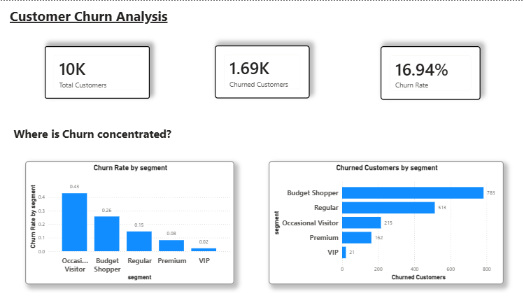
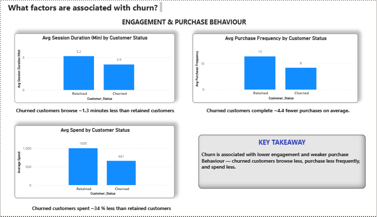
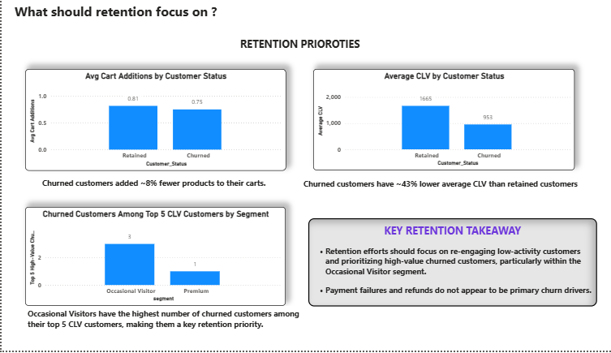

# 🛒 Customer Churn Analysis: A Hypothesis-Driven SQL Case Study

> **A business-oriented SQL project that investigates customer churn by testing hypotheses related to customer behavior, purchasing patterns, and Customer Lifetime Value (CLV) using SQL.**


---

# 📌 Project Highlights

* ✅ Investigated **9 business hypotheses** to understand customer churn.
* ✅ Conducted a hypothesis-driven customer churn analysis using an e-commerce database containing **10,000 customers**, **120,000 transactions**, and **80,000 browsing sessions**.
* ✅ Demonstrated SQL concepts including **CTEs**, **Window Functions**, **CASE expressions**, **LEFT JOINs**, and **Aggregate Functions**.
* ✅ Translated relational e-commerce data into evidence-based business insights.
* ✅ Focused on solving a real business problem rather than simply demonstrating SQL syntax.

---

# 📊 Executive Summary

The analysis identified clear behavioral differences between churned and retained customers.

| Business Metric           | Key Insight                                                                                                       |
| ------------------------- | ----------------------------------------------------------------------------------------------------------------- |
| ⏱ Browsing Behaviour      | Churned customers spent **approximately 1.3 fewer minutes** browsing the platform.                                |
| 🛒 Cart Activity          | Churned customers added **around 8% fewer products** to their shopping carts.                                     |
| 📦 Purchase Frequency     | Churned customers completed **approximately 4 fewer purchases** on average.                                       |
| 💰 Customer Spending      | Churned customers spent **approximately 34% less** than retained customers.                                       |
| 💳 Payment Outcomes       | Failed and refunded transaction rates showed **no meaningful difference** between churned and retained customers. |
| ⭐ Customer Lifetime Value | Churned customers consistently exhibited **lower Customer Lifetime Value (CLV)**.                                 |

---

# 📖 Project Overview

Customer churn is one of the most significant challenges faced by e-commerce businesses because losing existing customers directly impacts revenue, customer lifetime value, and long-term business growth.

This project investigates customer churn by comparing the behavior of churned and retained customers using SQL. Rather than randomly exploring the data, the analysis follows a **hypothesis-driven approach**, where each business question tests a specific assumption about customer churn.

The objective is not simply to write SQL queries but to demonstrate how SQL can be used to investigate business problems, validate hypotheses, and generate evidence-based insights that support business decision-making.

---

# 🎯 Business Objective

The objective of this project is to investigate customer churn by comparing the behavior of churned and retained customers, identifying behavioral patterns associated with churn, and highlighting insights that can support more informed customer retention decisions.

---

# 📂 Dataset

**Source:** [Synthetic E-Commerce Customer Behavior Dataset (Kaggle)](https://www.kaggle.com/datasets/lorenzoscaturchio/ecommerce-behavior)

> **Development Environment:** All SQL queries were written and executed using **DBeaver** connected to a **MySQL 8.0** database.

The analysis was performed on a relational e-commerce database consisting of five interconnected tables.


| Table           | Description                                                                |
| --------------- | -------------------------------------------------------------------------- |
| 👤 Customers    | Customer demographics, segments, churn status, and Customer Lifetime Value |
| 💳 Transactions | Purchase history and transaction outcomes                                  |
| 🌐 Sessions     | Browsing behaviour and cart activity                                       |
| 📦 Products     | Product catalog                                                            |
| ⭐ Reviews       | Customer product reviews                                                   |

### Dataset Summary

| Metric                  |   Value |
| ----------------------- | ------: |
| Total Customers         |  10,000 |
| Total Products          |   1,000 |
| Total Transactions      | 120,000 |
| Total Browsing Sessions |  80,000 |
| Total Reviews           |  25,000 |
| Customer Churn Rate     |  16.94% |

---
## 🗂 Database Schema

The project uses a relational e-commerce database consisting of five interconnected tables.

| Table | Primary Key | Description |
|--------|-------------|-------------|
| customers | customer_id | Customer information, churn status, and Customer Lifetime Value (CLV) |
| sessions | session_id | Browsing sessions and cart activity |
| transactions | transaction_id | Purchase transactions |
| products | product_id | Product catalog |
| reviews | review_id | Customer product reviews |

### Relationships

- `customers.customer_id` ↔ `sessions.customer_id`
- `customers.customer_id` ↔ `transactions.customer_id`
- `products.product_id` ↔ `transactions.product_id`
- `customers.customer_id` ↔ `reviews.customer_id`
- `products.product_id` ↔ `reviews.product_id`

# 🔬 Methodology

Unlike many SQL portfolio projects that primarily showcase SQL syntax, this project adopts a **hypothesis-driven business analysis** methodology.

Each SQL query was designed to investigate a specific business hypothesis related to customer churn. Rather than performing random exploratory queries, the analysis follows a structured workflow that mirrors how business analysts approach real-world business problems.

### Analytical Workflow

1. Understand the dataset and business context.
2. Perform Exploratory Data Analysis (EDA).
3. Formulate business hypotheses.
4. Test each hypothesis using SQL.
5. Interpret the analytical findings.
6. Translate findings into business implications.

This methodology ensures that every SQL query contributes directly to answering the central business problem.

---

# 📊 Exploratory Data Analysis

Before investigating customer churn, exploratory analysis was performed to understand the dataset and establish business context.

The exploratory analysis included:

* Total number of customers
* Total number of products
* Total number of transactions
* Total number of browsing sessions
* Customer churn distribution
* Customer segment distribution
* Country-wise customer distribution
* Transaction status distribution

These analyses provided a high-level understanding of the dataset before testing the business hypotheses.

---

# 💼 Business Scenario

Imagine joining an e-commerce company as a **Data Analyst**.

Management has observed increasing customer churn but lacks a clear understanding of the factors associated with it.

Your responsibility is to analyze customer behavior using SQL, identify meaningful behavioral patterns associated with churn, and provide data-driven insights that support informed customer retention decisions.

---

# ❓ Business Questions

The analysis investigates the following business questions:

1. Do churned customers spend less time browsing than retained customers?
2. Do churned customers add fewer items to their shopping carts?
3. Do churned customers make fewer completed purchases?
4. Do churned customers spend less money than retained customers?
5. Do churned customers experience a higher proportion of failed or refunded transactions?
6. Does customer churn vary across different customer segments?
7. Does customer churn vary across different countries?
8. Do churned customers have lower Customer Lifetime Value (CLV)?
9. Who are the Top 5 highest Customer Lifetime Value (CLV) customers within each customer segment?

---

# 📈 Key Findings

The analysis revealed several consistent behavioral differences between churned and retained customers.

Compared to retained customers, churned customers:

* Spent less time browsing the platform.
* Added fewer products to their shopping carts.
* Completed fewer purchases.
* Spent significantly less money.
* Had lower Customer Lifetime Value (CLV).

The analysis also found that:

* Customer churn varied across customer segments.
* Customer churn varied across different countries.
* Failed and refunded transaction rates showed no meaningful difference between churned and retained customers, suggesting that payment failures were not strongly associated with customer churn.
* High Customer Lifetime Value customers were identified within each customer segment, providing a basis for customer prioritization.

---

# 💡 Business Implications

Based on the findings of this analysis:

* Customer engagement appears to be closely associated with churn and should be monitored as an important business metric.
* Purchase frequency and customer spending may help identify customers at risk of churning.
* Customer churn should be monitored separately across different customer segments and geographic markets.
* Payment failures do not appear to be a primary factor associated with churn in this dataset.
* High-value customers can be prioritized when designing customer retention strategies.

---

# 📊 Power BI Dashboard


The findings from the SQL analysis were translated into an interactive Power BI dashboard designed to present the churn story from a business perspective.

The dashboard is structured across three pages:

### 1. Churn Overview

Provides a high-level view of customer churn, including the overall churn rate and where churn is concentrated across customer segments and geographic markets.



### 2. Churn Drivers

Examines behavioral differences between churned and retained customers, focusing on browsing behavior, purchase frequency, and customer spending.



### 3. Retention Priorities

Translates the analytical findings into potential retention priorities by examining customer engagement, Customer Lifetime Value (CLV), and high-value customers across segments.



### Dashboard File

The Power BI dashboard file is available in this repository:

**`Customer churn dashboard.pbix`**

> GitHub does not provide an in-browser preview for `.pbix` files. Download the file and open it using Microsoft Power BI Desktop to explore the interactive dashboard.
> --

# 🛠 SQL Concepts Demonstrated

* Common Table Expressions (CTEs)
* Window Functions
* ROW_NUMBER()
* Aggregate Functions
* CASE Expressions
* LEFT JOIN
* GROUP BY
* ORDER BY
* Conditional Aggregation
* Business-Oriented SQL Analysis

---
## 🚀 How to Run the Project

### Prerequisites

- MySQL 8.0 or later
- DBeaver (or any SQL client compatible with MySQL)

### Setup Instructions

1. Clone or download this repository.
2. Download the dataset from Kaggle:
   https://www.kaggle.com/datasets/lorenzoscaturchio/ecommerce-behavior
3. Import the CSV files into a MySQL database using DBeaver.
4. Ensure the following tables are available:
   - `customers`
   - `products`
   - `transactions`
   - `sessions`
   - `reviews`
5. Open `customer_churn_analysis.sql`.
6. Execute the SQL queries sequentially.
7. Compare the outputs with the findings documented in this README.
# 📁 Repository Structure

```text
customer-churn-analysis-sql/
│
├── customer_churn_analysis.sql
└── README.md
```
## 📌 Limitations

- The analysis primarily compares churned and retained customers using descriptive statistics.
- Average-based metrics were used throughout the analysis; future work could incorporate median-based comparisons and distributional analysis for variables that may be skewed.

---
## 🚀 Future Improvements

- Compare mean and median for potentially skewed variables.
- Assess the impact of outliers on average-based metrics.
- Extend the analysis with statistical significance testing where appropriate.

# 🎯 Conclusion

This project provides a data-driven investigation of customer churn by examining behavioral differences between churned and retained customers.

Rather than relying on assumptions, the analysis systematically tested business hypotheses to identify which customer behaviors were associated with churn, highlighted areas where no meaningful relationship was observed, and identified customers who contribute the greatest long-term value.

Beyond demonstrating SQL proficiency, this project showcases a structured analytical approach to solving business problems through hypothesis-driven analysis and evidence-based decision-making.

---

# 👨‍💻 Author

**Pravartan Shinde**

If you found this project interesting, feel free to connect or share your feedback. Every suggestion is appreciated!
